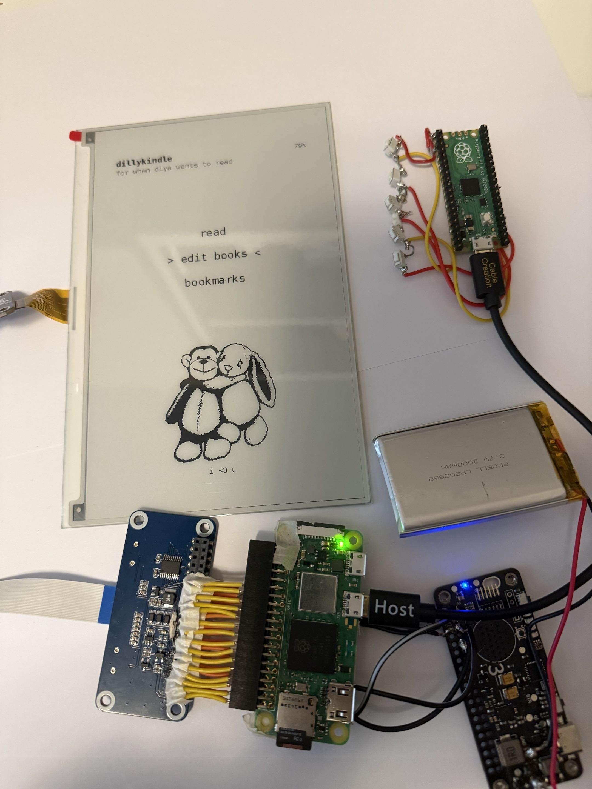
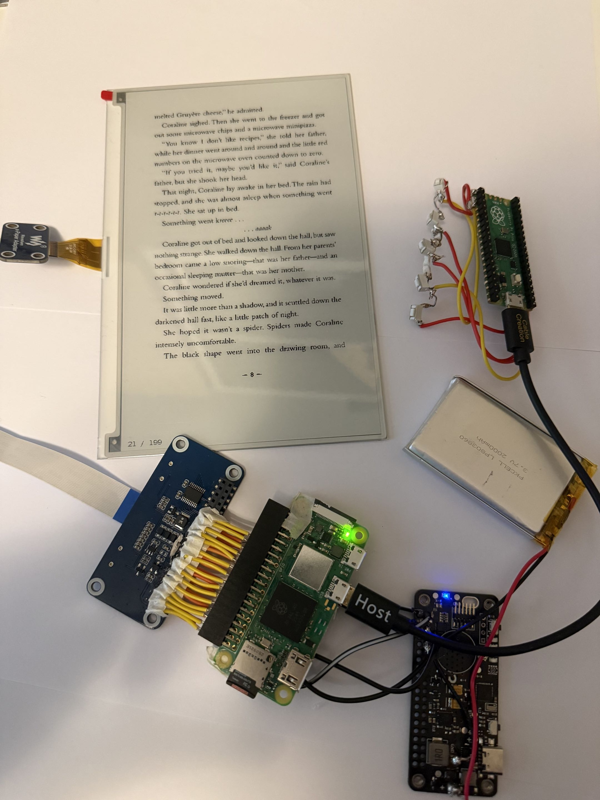

# DillyKindle

DillyKindle is a custom Raspberry Pi-based e-reader built with an e-paper display, physical button controls, local PDF storage, and wireless book uploading, made as a gift for a loved one.

## Overview

DillyKindle is designed to work like a small standalone Kindle-style device. It boots directly into a custom reading interface, stores books locally, saves reading progress, and allows new books to be uploaded from another phone or computer without needing SSH or manual file transfer.

## Project Highlights

- Built a Raspberry Pi Zero 2 W-based e-reader using an e-paper display, physical button controls, local storage, and a lightweight Python reading interface.

- Developed the software with Python, PyMuPDF for PDF rendering, JSON-based storage for books/bookmarks/progress, GPIO/Pico-based input handling, and systemd for automatic startup.

- Added standalone device features including Wi-Fi hotspot book uploads, browser-based file transfer, rechargeable battery support, battery-level monitoring, and planned power/sleep management for portable use.

## Features

- PDF reading interface
- E-paper display support
- Physical button navigation
- Local book library
- Bookmark saving
- Reading progress tracking
- Continue-reading support
- Browser-based book upload page
- Built-in Wi-Fi hotspot for wireless uploads
- Automatic launch on boot
- Lightweight JSON-based storage
- Rechargeable battery support
- Battery-level monitoring
- Planned low-power sleep/off behavior

## Hardware

The project uses:

- Raspberry Pi Zero 2 W
- E-paper display
- Physical navigation buttons
- GPIO/Pico-based button input system
- MicroSD card for the operating system, app files, and book storage
- Rechargeable battery/power-management hardware
- Custom enclosure planned

## Software Stack

The main software components are:

- Python
- PyMuPDF for rendering PDF pages
- JSON for storing book data, bookmarks, and reading progress
- Local HTTP server for browser-based uploads
- Raspberry Pi Wi-Fi hotspot configuration
- GPIO/Pico input handling for physical buttons
- systemd for automatic startup on boot

## How It Works

When the device turns on, the Raspberry Pi automatically launches the DillyKindle reading app.

Books are stored locally on the device. The reader keeps track of progress and bookmarks so the user can return to where they left off.

To add books, another device can connect to the DillyKindle Wi-Fi hotspot and open the local upload page in a browser. Uploaded books are saved directly to the local library.

Physical buttons are used for reading controls such as page navigation, selecting books, saving bookmarks, and returning to the home screen.

## Current Status

The main software system is functional, including PDF reading, local storage, bookmarks, reading progress, physical controls, automatic startup, and hotspot-based book uploads.

The remaining work is focused on hardware refinement, rechargeable power integration, battery display improvements, sleep/off behavior, and the final physical case.
