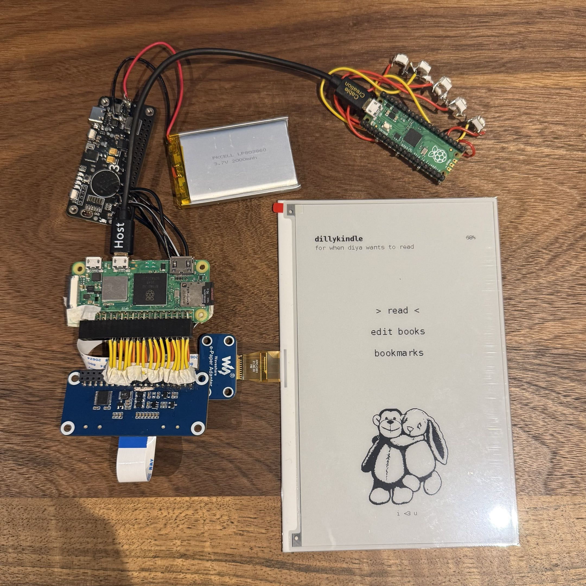
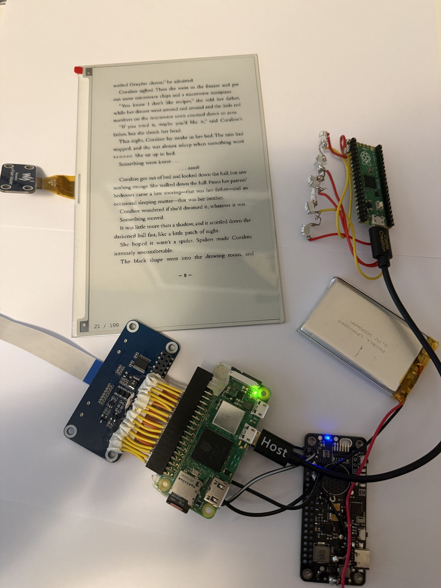

# DillyKindle

DillyKindle is a small Raspberry Pi e-reader I built as a gift. It displays locally stored PDFs on an e-paper screen and uses physical buttons for reading and navigating the library.

## Features

- Read PDFs with physical controls for page turns, book selection, bookmarks, and returning home.
- Save bookmarks and reading progress, then continue where you left off.
- Upload books from a phone or computer through the device's Wi-Fi hotspot and browser-based upload page. No SSH or cable transfer is needed.
- Launch the reading app automatically when the device boots.
- Run from a rechargeable battery and monitor its charge level.

## Build

The hardware uses a Raspberry Pi Zero 2 W, an e-paper display, physical buttons with GPIO/Pico-based input handling, a microSD card for the system and books, and rechargeable battery and power-management hardware.

The reading app is written in Python. PyMuPDF renders PDF pages, JSON files store library data, bookmarks, and reading progress, and a local HTTP server handles uploads. The Pi provides the Wi-Fi hotspot, and systemd starts the app on boot.

## Status

PDF reading, local storage, bookmarks, progress tracking, button controls, automatic startup, and wireless uploads are working. I'm still refining the hardware and planning low-power sleep/off behavior and a final enclosure.
